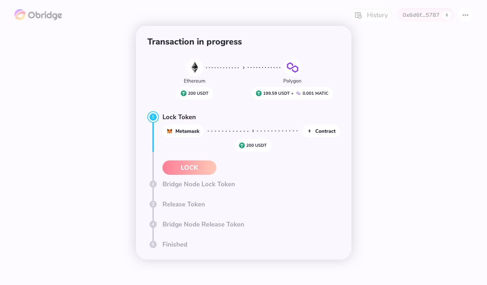
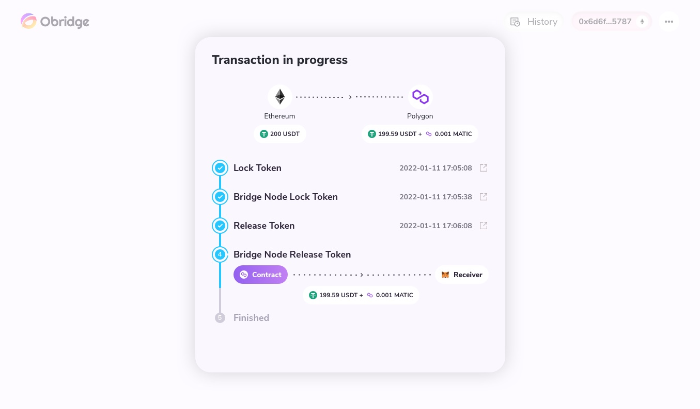

# Atomic Swap

As discussed before, a unique feature of Obridge is the atomic swap design. After clicking the SWAP Token button, the dapp will guide you through the atomic swap process. Typically, it will take 4-5 minutes to finish the whole process. It is important to note that while there are multiple steps performed by the user and the LP node matched by the dapp, the atomic swap algorithm ensures that all steps would succeed or fail as one unit. There is no chance for a half-completed swap.

The first step is to lock your token from the source chain into the HTLC contract. Then, click the LOCK button and pay the gas fee from the source chain via MetaMask.

The second step is to deploy a contract that locks the corresponding token from your target chain by the Bridge Node. You don't need to take care of this step here.

The third step is to release the token from your sourced chain to the Bridge Node since we have matched a LP. Then, click the CONFIRM button to pay the gas fee from the source chain again via MetaMask. You DO NOT need to change the target chain as other bridges.

The fourth step is to wait for the Bride Node to release the token from your targeted chain. If you don't customize the receiving address, you will see the token on your current MetaMask address soon.

When you see the Finished comes up, you could go to MetaMask and check out your address balance from both chains. Don't forget to change the network on MetaMask.