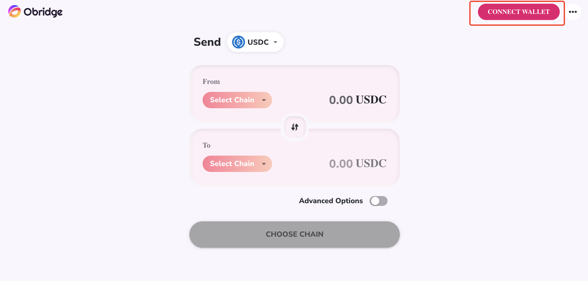
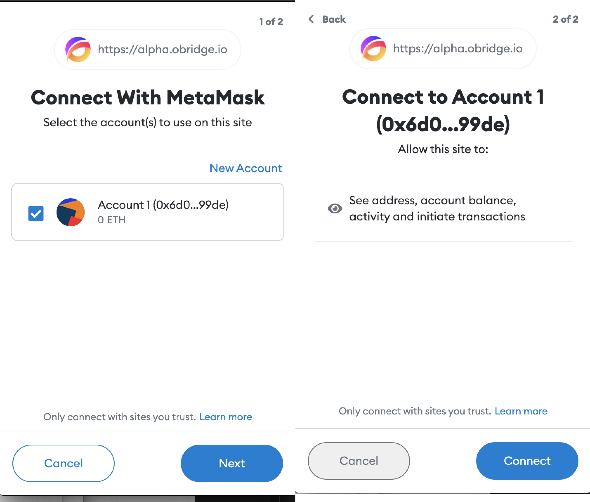

# Connect to Your Wallet

In this section, we will walk you through how to make preparation for Obridge.

Before you start to make your token asset flow,  you need to connect to your wallet and Obridge.

> For Now, Obridge only supports MetaMask wallet.

Firstly, launch the Obridge App on your browser.

https://alpha.obridge.io/

Next, click the CONNECT WALLET button on the right top of the app page.

Then, the MetaMask Chrome Extension will pop on two confirmation pages continuously. Click the Next button, and then, the Connect button to process.

After that, you will see your wallet address on the right top of the page, which means you connect your wallet successfully.

Next, let's swap your token to another chain.
