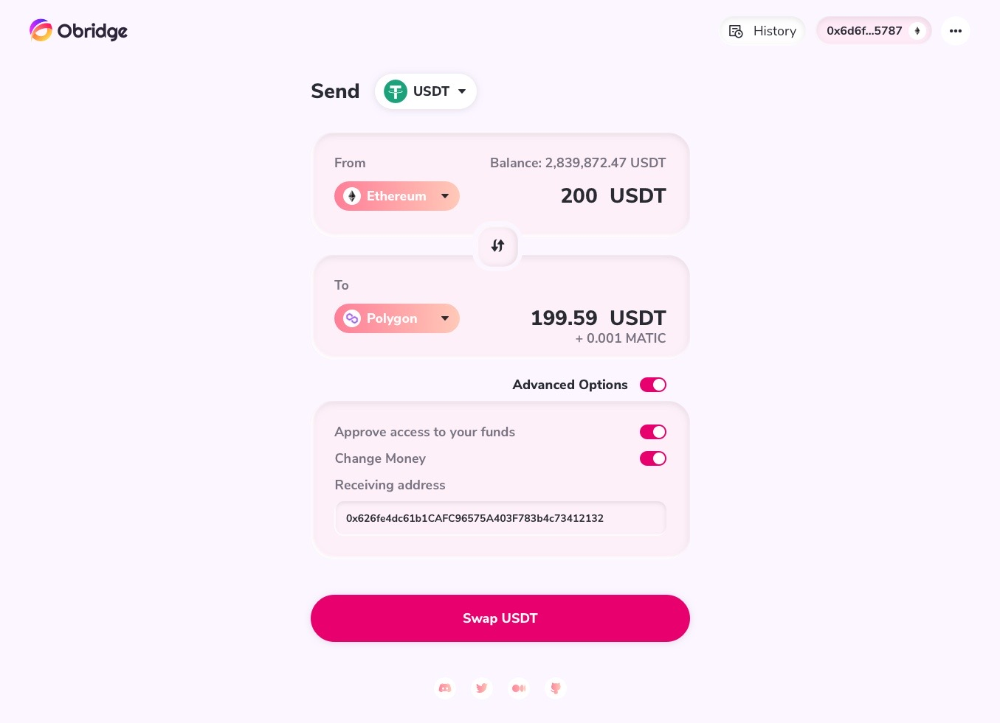

# Request tokens exchange in the way of Bridge

> Before you start, please make sure the tokens you want to transfer are already in your wallet.

Let's identify some concepts firstly.

The source chain: the chain you own token now
The target chain: the chain you want to own token via Obridge

Let's say you want to transfer 200 USDT from Ethereum to Polygon. So Ethereum is the source chain, and Polygon is the target chain.

As you can see from the above image, scroll down the USDT button to select the token you want to transfer. Next, scroll down the Ethereum button in the From section to choose the source chain. Last but not least, scroll down the Polygon button in the To Section to select the source chain.

Turn on the Advanced Option, and you could customize your swap.

After configuring all settings, Click the Swap USDT button to process the transaction.
